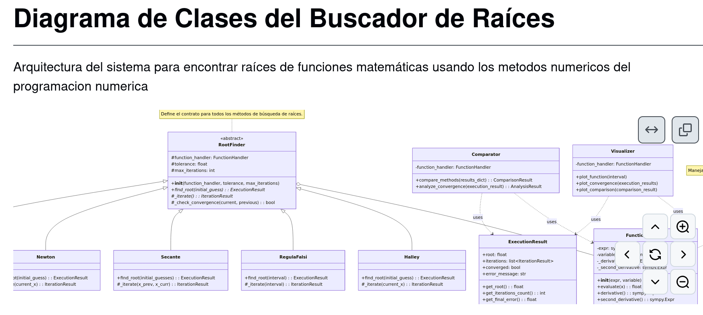
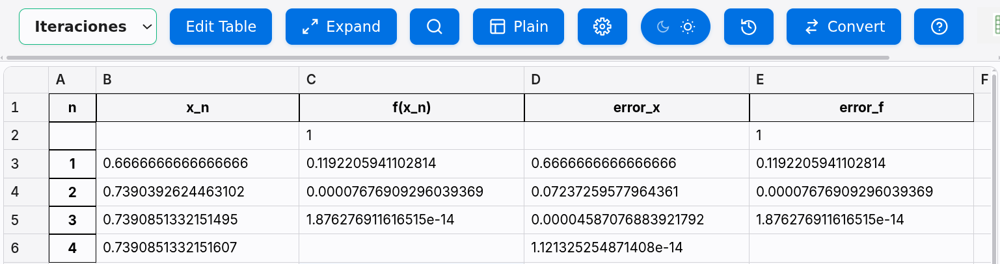
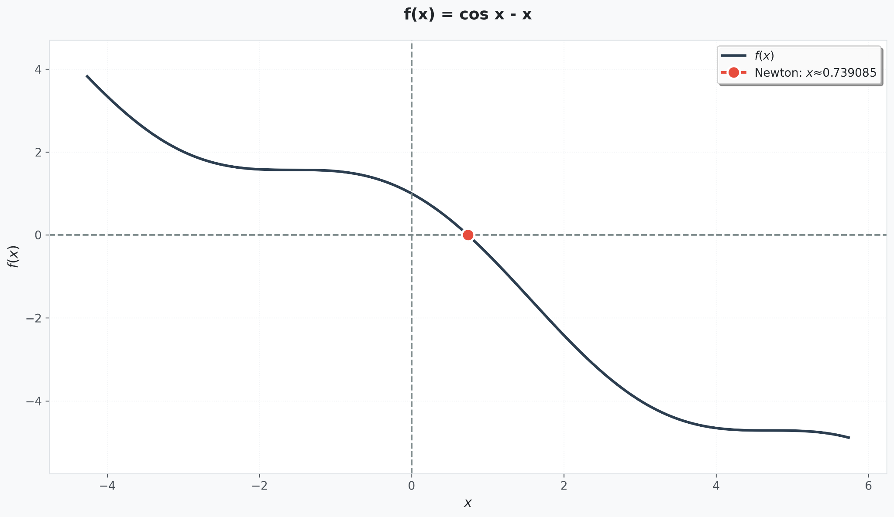
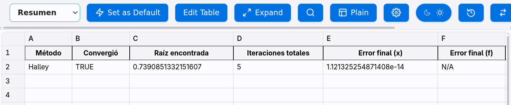
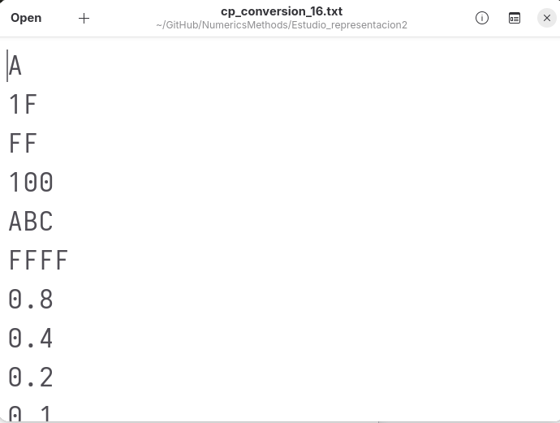
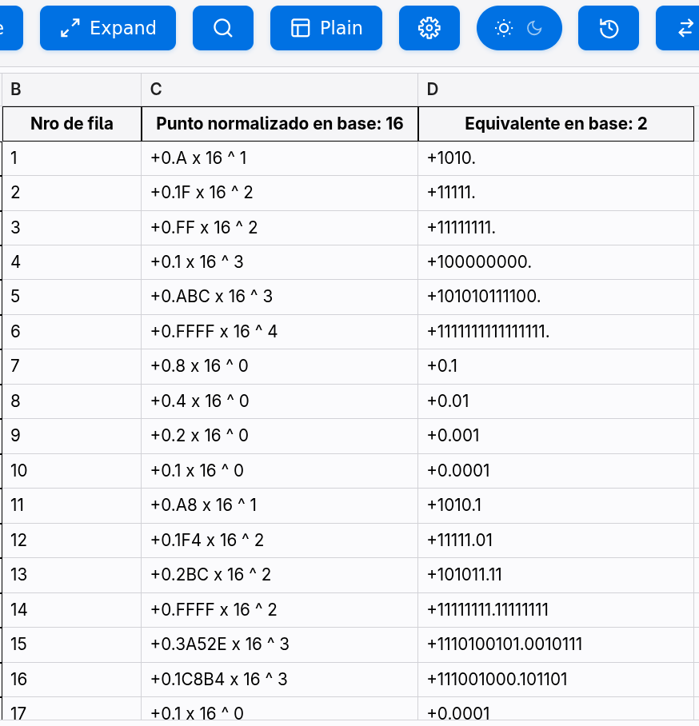

<div align="center">

# R a R

*Herramienta computacional orientada al análisis numérico y la simulación matemática de funciones continuas y discretas.*


</div>

---

## Sobre el Proyecto
El proyecto se basa en el desarrollo de un pequeño modulo de librerias de metodos numericos y representacion de punto flotantes arbitrarios. Sobre los mismos se desarrollaron scripts utilizandos librerias como matplotlib y pandas para la automatizacion y el estudio de los metodos y las representaciones de punto decimal.

---

## Objetivos del Proyecto

- **Abstracción Algorítmica:** Implementar una familia de algoritmos para la localización de raíces empleando el patrón de diseño *Strategy*.
- **Análisis de Convergencia:** Desarrollar herramientas interactivas de experimentación numérica para estudiar la velocidad de convergencia y estabilidad.
- **Modelado Numérico:** Comprender la representación interna de los números en sistemas de punto flotante de precisión arbitraria, analizando los fenómenos de redondeo y truncamiento.
- **Visualización Científica:** Automatizar la producción de reportes dinámicos, gráficos cartesianos y hojas de cálculo estructuradas para el análisis estadístico de los resultados.

---

## Build & run

```bash
# 1. Clonar el Repositorio
git clone https://github.com/Joacoromero06/Raylib.git
cd Raylib

# Para utilizar, explorar los módulos específicos descritos a continuación.
```

---

## Estructura del Proyecto

```text
NumericsMethods/
├── PP-NM-SE Book/ # no relevante
├── Estudio_metodos1/
│   ├── core/
│   │   ├── FunctionHandler.py
│   │   ├── NumericalMethods.py
│   │   ├── RootFinding.py
│   │   ├── Visualizer.py
│   │   ├── Visualizer2.py
│   │   └── test.py
│   └── disign/ # no relevante
├── Estudio_polinomios/
│   ├── Coefficient.py
│   ├── Polynomial.py
│   └── prueba.ipynb
├── Estudio_representacion/
│   ├── models/
│   │   ├── Mantisa.py
│   │   ├── Maya.py
│   │   └── PuntoFlotante.py
│   ├── tests/ # no relevante
│   ├── utils/ # no relevante
│   └── main.py
├── Estudio_representacion2/
│   ├── testeados/ # no relevante
│   ├── PuntoFlotante_B.py
│   ├── cp_conversion_16.txt
│   ├── tabla_conversion.xlsx
│   ├── crear_tabla_eq.py
│   └── test.py
```

---

## Modulo Metodos Numericos

El modulo metodos numericos se basa en el patron strategy para resolver ecuaciones utilizando las diferentes formas de resolucion de los diversos metodos (Halley, Newton, etc)

<div align="center">
  
</div>

---

## Cómo Usar
Para evaluar una función, se edita el script `test.py` ubicado en `Estudio_metodos1/core/`. El sistema inicializa la expresión matemática mediante `FunctionHandler` y delega la resolución a un objeto de la jerarquía `NumericalMethods`.

**Nota sobre aproximaciones iniciales:** Para aquellos métodos iterativos que requieren un intervalo acotado o múltiples puntos de partida (como Bisección o Secante), el módulo calcula automáticamente una aproximación óptima en la vecindad del punto sugerido si el usuario no introduce explícitamente los límites $[a, b]$. 

```python
   1 │ from FunctionHandler import FunctionHandler
   2 │ import NumericalMethods as nm
   3 │ from Visualizer import Visualizer
   4 │ 
   5 │ func = FunctionHandler('cos x - x')
   6 │ solver = nm.Newton(function=func)
   7 │ 
   8 │ viz = Visualizer(func)
   9 │ viz.plot_initial()
  10 │ viz.save()
  11 │ result = solver.find_root(0)
  12 │ viz.add_root_from_result(result)
  13 │ viz.save()
  14 │ 
```

Al ejecutar `python3 test.py`, el sistema exporta una representación geométrica de la convergencia en formato PNG. Simultáneamente, el entorno genera un informe estructurado en formato Excel mediante `pandas`, el cual incluye una hoja con la traza iterativa detallada y otra con el resumen matemático del comportamiento del resolvedor.

#### Galería de Reportes Generados

<div align="center">
  <table style="border: none;">
    <tr>
      <td align="center" valign="top" style="border: none;" width="50%">
        
        <br><em>Visualización geométrica de la raíz</em>
      </td>
      <td align="center" valign="top" style="border: none;" width="50%">
        
        <br><em>Traza analítica de iteraciones</em>
      </td>
    </tr>
    <tr>
      <td align="center" colspan="2" style="border: none;">
        <br>
        
        <br><em>Resumen analítico del comportamiento del solver</em>
      </td>
    </tr>
  </table>
</div>

---

## Módulo Sistema de Representación

Este submódulo aborda el modelado algebraico de la aritmética de punto flotante sobre sistemas computacionales. Define un conjunto de abstracciones capaces de instanciar números en cualquier base aritmética de partida ($\beta$) y transformarlos a sistemas digitales de llegada ($\beta'$), controlando explícitamente la cantidad de dígitos significativos de la mantisa ($t$) y aplicando políticas estrictas de redondeo simétrico o truncamiento.

### Cómo Usar
Los datos de entrada se estructuran en un archivo de texto plano (v.g., `cp_conversion_16.txt`) donde cada línea representa un valor en el sistema numérico origen. Posteriormente, se configura y ejecuta el script `crear_tabla_eq.py`.

```python
from PuntoFlotante_B import PuntoFlotante_B
   2 │ import pandas as pd
   3 │ 
   4 │ 
   5 │ """ Parte para leer desde el archivo """
   6 │ with open( '<nombreArchivoNrosBaseB>' ) as archivillo:
   7 │     lineas = [linea.split() for linea in archivillo.readlines()] # Cada linea es una lista de palabras, l
     │ a 1era es el nro
   8 │ 
   9 │     """ Datos del algoritmo """
  10 │     B = 16 # base actual
  11 │     B_prima = 2 # base de llegada
  12 │     t = 52 # cantidad de digitos usados
  13 │     t_redondear = 5 # cantidad de digitos para redondear
  14 │     
  15 │     """ Datos para cargar la tabla"""
  16 │     datos = []
  17 │     nro_fila = 1
  18 │ 
  19 │     """ Algoritmo """
  20 │     for nro_str in lineas:
  21 │         x_16 = PuntoFlotante_B(nro_str[0], B)
  22 │ 
  23 │         if not x_16._chequear_errores(True):# true es para que muestre el tipo de error
  24 │             x_2 = x_16.convertir_a_base(B_prima, t)
  25 │             
  26 │             # Enves de mostrar, lo cargamos a un pandas
  27 │             datos.append( [nro_fila, x_16.mostrar_normalizado(), x_2.mostrar_sin_normalizar()] )
  28 │         
  29 │         nro_fila += 1
  30 │     
  31 │     """ Creo la tabla """
  32 │     df = pd.DataFrame(datos, columns=[
  33 │         'Nro de fila',
  34 │         f'Punto normalizado en base: {B}',
  35 │         f'Equivalente en base: {B_prima}'
  36 │     ])
  37 │     df.to_excel('<nomTablaRtdoBaseBprima>.xlsx')
```

El script parseará el flujo de caracteres, normalizará los valores reales en la estructura intermedia y guardará una matriz de datos en un archivo Excel listo para estudios comparativos de precisión.

#### Flujo de Datos (Entrada / Salida)

<div align="center">
  <table style="border: none;">
    <tr>
      <td align="center" valign="top" style="border: none;" width="45%">
        
        <br><em>Set de datos iniciales (`.txt`)</em>
      </td>
      <td align="center" valign="middle" style="border: none;" width="10%">
        <h1>➔</h1>
      </td>
      <td align="center" valign="top" style="border: none;" width="45%">
        
        <br><em>Matriz de equivalencias calculada (`.xlsx`)</em>
      </td>
    </tr>
  </table>
</div>
